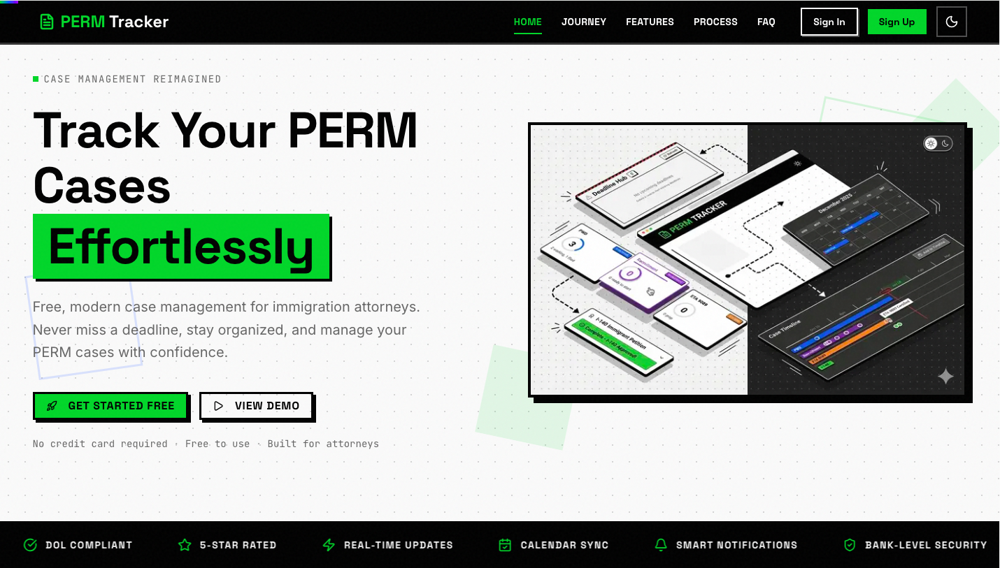
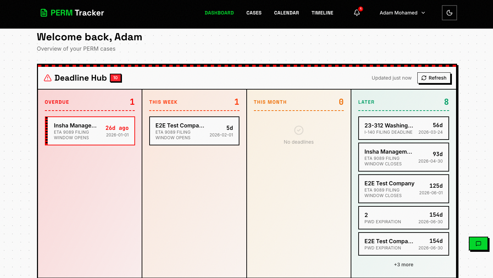
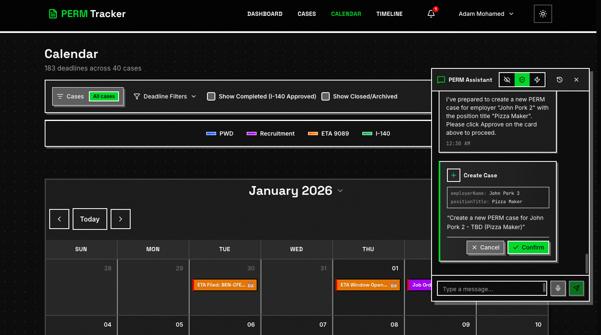

# PERM Tracker

**Free, modern case management for immigration attorneys tracking Permanent Labor Certification (PERM) cases.**


---

## Live Application

**URL:** https://permtracker.app

**Test Credentials:** See `v2/.env` (gitignored)

---

## Screenshots

### Homepage


### Dashboard

*Deadline Hub showing overdue, upcoming, and future deadlines at a glance*

### Cases

*Case management with filtering, search, status badges, and calendar sync*

### Calendar & AI Assistant

*Calendar view with deadline color-coding and AI chat assistant for natural language case management*

---

## Features

### Case Management
- Full CRUD with real-time sync, duplicate detection, bulk operations
- Smart date validation per 20 CFR 656.40(c) regulations
- Auto-calculations (PWD expiration, ETA 9089 windows, I-140 deadlines)
- Cascade logic - dependent dates auto-calculate
- RFI/RFE tracking with due dates

### Dashboard & UX
- Real-time case counts, upcoming deadlines, recent activity
- Timeline visualization with milestone tracking
- Calendar view with deadline color coding
- Privacy mode for screen sharing
- Dark/light mode, responsive design, PWA support

### Notifications
- In-app notification bell with unread badge
- Email notifications via Resend
- Push notifications via Web Push
- Daily deadline reminders (cron), weekly digest

### AI Chat Assistant
- Natural language case queries and updates
- Multi-provider fallback (Gemini, OpenRouter, Groq, Cerebras)
- Web search integration for PERM regulations
- Tool confirmation for destructive actions

### Google Calendar Sync
- One-click OAuth connection
- Automatic deadline event creation
- Bulk sync for all cases

---

## Tech Stack

| Layer | Technology |
|-------|------------|
| **Frontend** | Next.js 16 + React + TypeScript |
| **Backend** | Convex (serverless functions) |
| **Database** | Convex (built-in) |
| **Styling** | Tailwind CSS + shadcn/ui |
| **Authentication** | Convex Auth + Google OAuth |
| **Email** | Resend |
| **Push Notifications** | Web Push (VAPID) |
| **Hosting** | Vercel (frontend) + Convex Cloud (backend) |

---

## Quick Start

### Prerequisites
- Node.js 18+
- pnpm (recommended) or npm

### Local Development

```bash
# Navigate to v2 directory
cd v2

# Install dependencies
pnpm install

# Start Convex dev server (Terminal 1)
npx convex dev

# Start Next.js dev server (Terminal 2)
pnpm dev
```

**Local URLs:**
- Frontend: http://localhost:3000
- Convex Dashboard: https://dashboard.convex.dev

### Environment Variables

Copy `.env.example` to `.env.local` and fill in values:

```env
# Convex
CONVEX_DEPLOYMENT=dev:your-deployment
NEXT_PUBLIC_CONVEX_URL=https://your-deployment.convex.cloud

# Google OAuth
GOOGLE_CLIENT_ID=your_google_client_id
GOOGLE_CLIENT_SECRET=your_google_client_secret

# Push Notifications
NEXT_PUBLIC_VAPID_PUBLIC_KEY=your_vapid_public_key
```

Server-side secrets (Convex Dashboard):
- `RESEND_API_KEY` - Email delivery
- `VAPID_PRIVATE_KEY` - Push notifications
- `JWT_PRIVATE_KEY` - Auth tokens

---

## Testing

### Test Commands

| Command | Description | Time |
|---------|-------------|------|
| `pnpm test` | Watch mode (development) | Instant |
| `pnpm test:fast` | Unit + PERM tests only | ~30s |
| `pnpm test:run` | Full suite (CI) | ~9 min |
| `pnpm test:e2e` | Playwright E2E tests | ~2 min |

### Coverage

- **3600+ tests** passing
- **100% coverage** on PERM business logic
- Component, hook, and integration tests included

---

## Project Structure

```
v2/
├── convex/                  # Convex backend
│   ├── lib/perm/           # Central PERM business logic
│   ├── cases.ts            # Case CRUD
│   ├── notifications.ts    # Notifications
│   ├── scheduledJobs.ts    # Cron jobs
│   └── schema.ts           # Database schema
├── src/
│   ├── app/                # Next.js pages
│   ├── components/         # React components
│   └── lib/perm/           # Frontend re-exports
└── test-utils/             # Test utilities
```

---

## Documentation

- **[v2/CLAUDE.md](v2/CLAUDE.md)** - Developer guide with API reference
- **[perm_flow.md](perm_flow.md)** - PERM process workflow (canonical source)
- **[.planning/](/.planning)** - Architecture and planning docs

---

## Deployment

### Automatic Deployment

Push to main branch triggers:
- **Vercel:** Frontend rebuild and deploy
- **Convex:** Backend functions sync

```bash
git add .
git commit -m "feat: your feature"
git push origin main
```

### Manual Convex Deploy

```bash
cd v2
npx convex deploy --prod
```

---

## Security

- **Convex Auth** - Secure session management
- **Row-Level Security** - Users only access their own data
- **HTTPS** - Enforced in production
- **Activity Timeout** - Auto-logout after inactivity

---

## License

This project is free to use for immigration attorneys and law firms.

---

## Acknowledgments

- **DOL PERM Program:** https://flag.dol.gov/programs/perm
- **20 CFR 656.40:** PERM regulations
- **Convex:** Serverless backend platform
- **Vercel:** Frontend hosting

---

**Built with Claude Code**
**Last Updated:** January 2026
**Version:** 2.0
