# PERM Tracker Chatbot Architecture

## Table of Contents
1. [Overview](#overview)
2. [High-Level Architecture](#high-level-architecture)
3. [RAG Pipeline](#rag-pipeline)
4. [Tool System](#tool-system)
5. [Message Processing & Streaming](#message-processing--streaming)
6. [UI Components](#ui-components)
7. [Backend (Convex)](#backend-convex)
8. [Context Injection](#context-injection)
9. [File Reference](#file-reference)

---

## Overview

The PERM Tracker chatbot is a production-grade AI assistant built with:
- **Frontend:** Next.js 16 + React 19 + TypeScript
- **AI SDK:** Vercel AI SDK v5 with streaming support
- **Backend:** Convex serverless functions
- **RAG:** `@convex-dev/rag` with Google Gemini embeddings
- **Multi-Provider Fallback:** 8 models across 5 providers (Gemini, OpenRouter, Groq, Cerebras, Mistral)

### Key Capabilities
- **Domain Knowledge:** PERM immigration regulations (20 CFR Part 656)
- **Case Management:** Query, create, update, archive, delete cases
- **Deadline Tracking:** PWD expiration, recruitment windows, filing deadlines
- **Calendar Sync:** Google Calendar integration for deadlines
- **Knowledge Search:** RAG-based semantic search over PERM regulations
- **Web Search:** Real-time DOL/USCIS processing times and updates

---

## High-Level Architecture

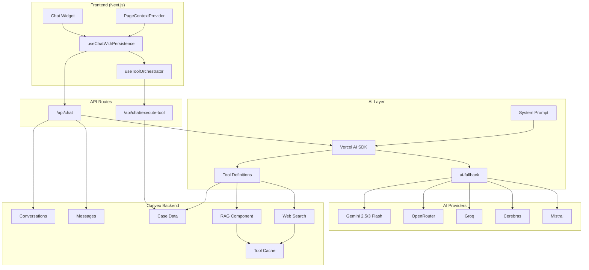

### Component Responsibilities

| Component | Responsibility |
|-----------|---------------|
| **ChatWidget** | Floating chat UI with message list, input, history |
| **useChatWithPersistence** | Streaming + Convex persistence + optimistic updates |
| **useToolOrchestrator** | Tool execution, confirmations, navigation |
| **PageContextProvider** | Makes AI aware of current page, selected cases |
| **/api/chat** | Main streaming endpoint with multi-provider fallback |
| **/api/chat/execute-tool** | Executes tools after user confirmation |
| **Convex Backend** | Data persistence, queries, RAG, web search |

---

## RAG Pipeline

The RAG (Retrieval-Augmented Generation) pipeline provides the chatbot with up-to-date PERM domain knowledge.

### RAG Architecture

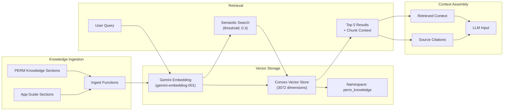

### Knowledge Base Structure

**21+ PERM Knowledge Sections:**

| Section | Content | CFR Reference |
|---------|---------|---------------|
| PWD Application & Expiration | 90-day rule, June 30 rule | 20 CFR 656.40 |
| Recruitment Stage | 180-day window, required methods | 20 CFR 656.17 |
| Notice of Filing | 10 business day posting | 20 CFR 656.10 |
| Job Order | 30-day SWA posting | 20 CFR 656.17 |
| Sunday Ads | 7-day separation rule | 20 CFR 656.17 |
| Professional Occupation | 3 additional methods | 20 CFR 656.17 |
| 30-180 Filing Window | ETA 9089 timing rules | 20 CFR 656.17 |
| I-140 Deadline | 180-day certification window | 20 CFR 656.30 |
| RFI/RFE Response | Strict 30-day deadline | 20 CFR 656.20 |

### RAG Search Flow

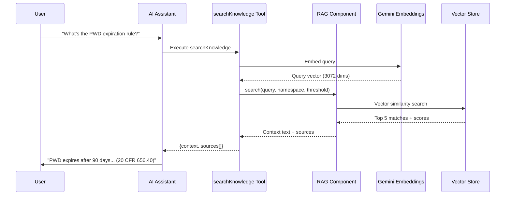

### Configuration

```typescript
// convex/lib/rag/index.ts
export const rag = new RAG(components.rag, {
  textEmbeddingModel: google.embedding("gemini-embedding-001"),
  embeddingDimension: 3072,
});

// Search parameters
const result = await rag.search(ctx, {
  namespace: "perm_knowledge",
  query: userQuestion,
  limit: 5,
  chunkContext: { before: 1, after: 1 },
  vectorScoreThreshold: 0.3,  // Low for broad recall
});
```

---

## Tool System

The chatbot has 28 tools across 8 categories, each with defined permissions.

### Tool Categories

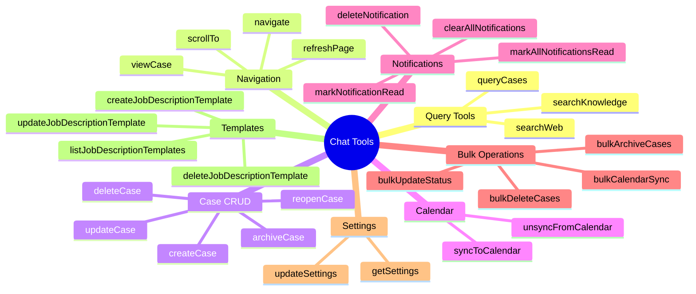

### Permission System

| Permission Level | Behavior in CONFIRM Mode | Behavior in AUTO Mode | Tools |
|-----------------|--------------------------|----------------------|-------|
| **autonomous** | Execute immediately | Execute immediately | Query, Navigation, getSettings |
| **confirm** | Wait for user approval | Execute immediately | Case CRUD, Calendar, Notifications, Settings |
| **destructive** | Always wait for approval | Always wait for approval | deleteCase, bulk operations |

### Tool Execution Flow

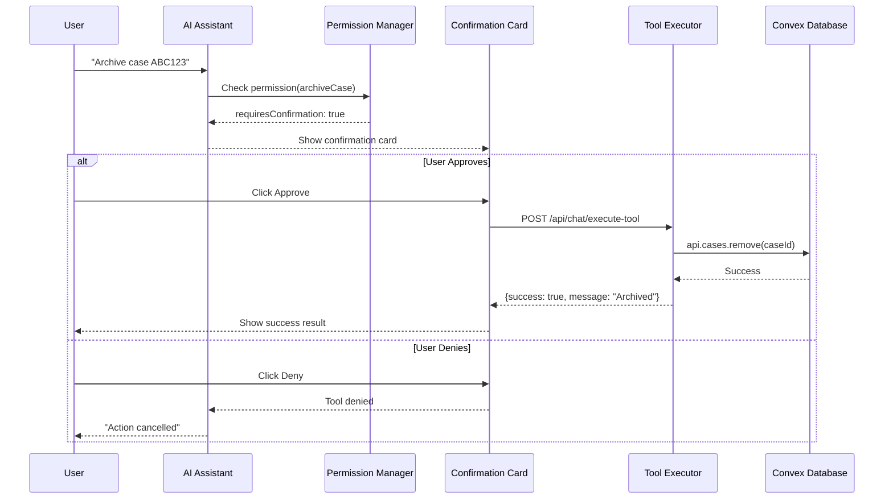

### Tool Definition Structure

```typescript
// src/lib/ai/tools.ts
export const queryCases = tool({
  description: `Query the user's PERM cases with flexible filters...`,
  parameters: z.object({
    caseStatus: z.enum(["pwd", "recruitment", "eta9089", "i140", "closed"]).optional(),
    progressStatus: z.enum(["working", "waiting_intake", ...]).optional(),
    hasRfi: z.boolean().optional(),
    hasRfe: z.boolean().optional(),
    hasOverdueDeadline: z.boolean().optional(),
    deadlineWithinDays: z.number().optional(),
    searchText: z.string().optional(),
    // ... more filters
  }),
  execute: async (params) => {
    // Execute with caching
    return executeWithCache("query_cases", params, () =>
      fetchQuery(api.chatCaseData.queryCases, params)
    );
  }
});
```

---

## Message Processing & Streaming

### Streaming Architecture

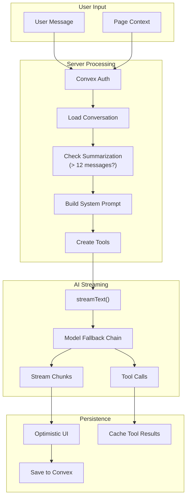

### Model Fallback Chain

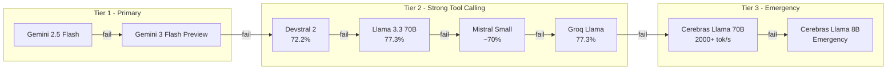

### Message State Machine

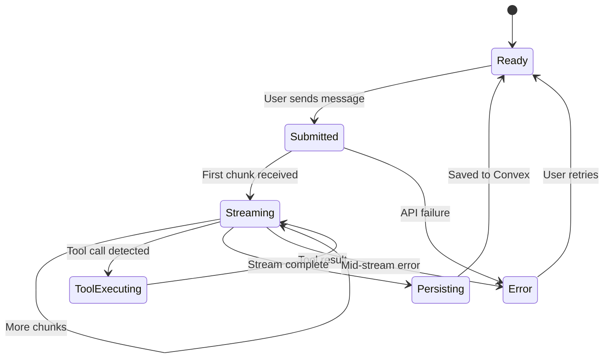

### Optimistic Updates

```typescript
// useChatWithPersistence.ts
const handleSend = async (message: string) => {
  // 1. Optimistic: Show immediately
  flushSync(() => setOptimisticMessage({ role: 'user', content: message }));

  // 2. Create conversation if needed
  const convId = conversationId ?? await createConversation();

  // 3. Fire-and-forget: Save to Convex (don't wait)
  createUserMessage({ conversationId: convId, content: message });

  // 4. Stream response from AI
  await sendMessage(message);

  // 5. Clear optimistic when persisted message appears
  // (handled by useEffect watching persisted messages)
};
```

---

## UI Components

### Component Hierarchy

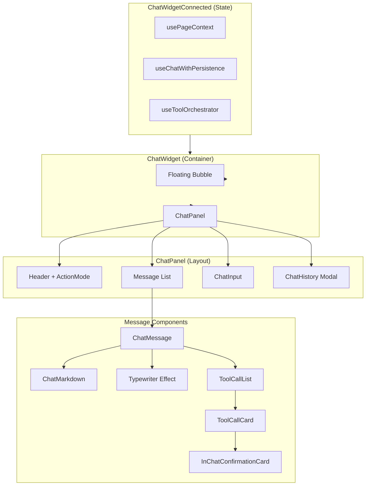

### Key UI Features

1. **Typewriter Effect:** 3 characters revealed every 15ms
2. **Auto-scroll:** Tracks user scroll position, pauses if user scrolls up
3. **Voice Input:** Web Speech API with transcript insertion
4. **Tool Confirmations:** Inline approval/denial cards
5. **Action Mode Toggle:** OFF / CONFIRM / AUTO segmented control
6. **Chat History:** Slide-out panel for conversation switching

### Message Rendering

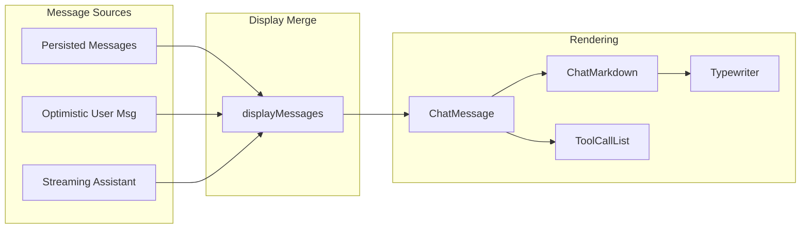

---

## Backend (Convex)

### Database Schema

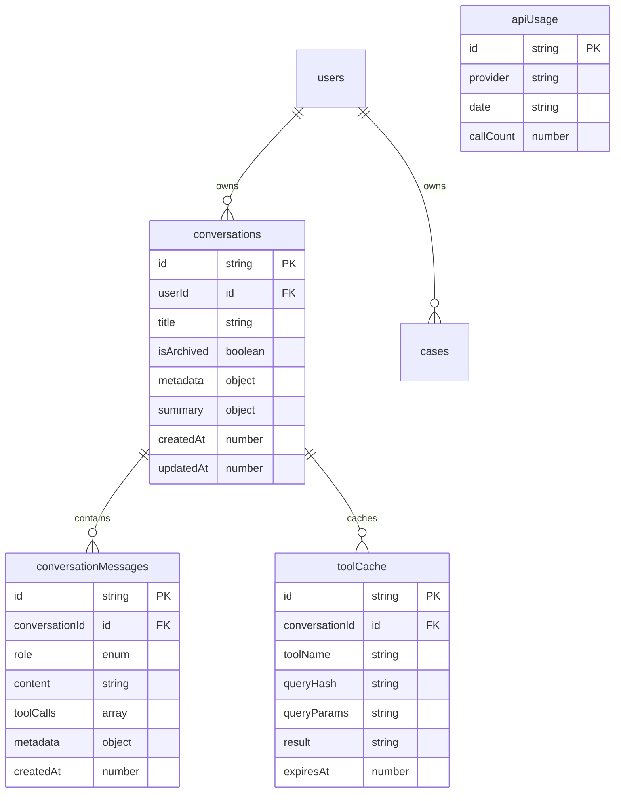

### Convex Functions

| Module | Function | Type | Purpose |
|--------|----------|------|---------|
| `conversations` | `create` | mutation | Create new conversation |
| | `get` | query | Get conversation by ID |
| | `list` | query | List user's conversations |
| | `deleteConversation` | mutation | Delete conversation + messages |
| `conversationMessages` | `createUserMessage` | mutation | Save user message |
| | `createAssistantMessage` | mutation | Save assistant response + tools |
| | `list` | query | Get messages in conversation |
| | `updateToolCallResult` | mutation | Persist tool execution result |
| `chatCaseData` | `queryCases` | query | Flexible case queries |
| | `getCaseSummary` | query | Aggregate case statistics |
| `knowledge` | `searchKnowledge` | action | RAG semantic search |
| `webSearch` | `searchWeb` | action | Multi-provider web search |
| `toolCache` | `get` / `set` | query/mutation | Cache tool results |

### Web Search Fallback

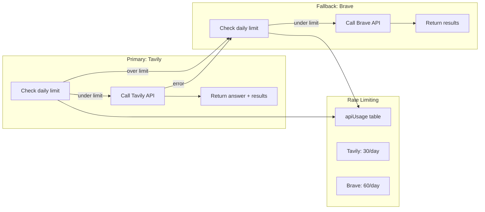

---

## Context Injection

### Multi-Layer Context

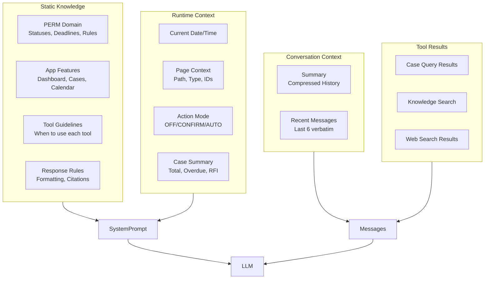

### Page Context Types

```typescript
interface PageContext {
  // Always present
  path: string;
  pageType: 'dashboard' | 'cases_list' | 'case_detail' | 'calendar' | 'notifications' | 'settings';
  timestamp: number;

  // Case detail page
  currentCaseId?: string;
  currentCaseData?: CaseSummary;

  // Cases list page
  filters?: { status?, progressStatus?, search? };
  pagination?: { totalCount };
  visibleCaseIds?: string[];   // Cases on screen
  selectedCaseIds?: string[];  // Checked cases

  // Calendar page
  calendarFilters?: { view, dateRange };
  visibleEventCount?: number;

  // Notifications page
  notificationTab?: 'all' | 'unread';
  unreadCount?: number;
}
```

### Conversation Summarization

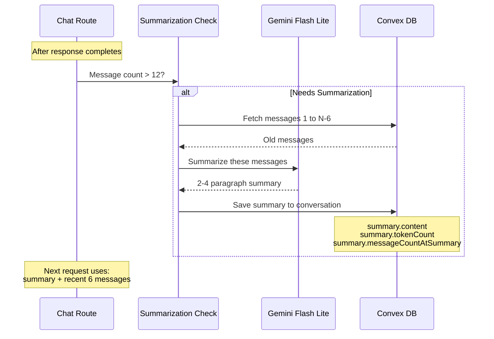

---

## File Reference

### Core Files

| Category | File | Purpose |
|----------|------|---------|
| **API Routes** | `src/app/api/chat/route.ts` | Main streaming endpoint |
| | `src/app/api/chat/execute-tool/route.ts` | Tool execution |
| **AI Layer** | `src/lib/ai/providers.ts` | Multi-provider config |
| | `src/lib/ai/tools.ts` | 28 tool definitions |
| | `src/lib/ai/system-prompt.ts` | System prompt builder |
| | `src/lib/ai/summarize.ts` | Conversation compression |
| | `src/lib/ai/cache.ts` | Tool result caching |
| | `src/lib/ai/tool-permissions.ts` | Permission system |
| **Hooks** | `src/hooks/useChatWithPersistence.ts` | Chat state + streaming |
| | `src/hooks/useToolOrchestrator.ts` | Tool execution flow |
| | `src/hooks/useToolConfirmations.ts` | Confirmation state |
| | `src/lib/ai/page-context.tsx` | Page awareness |
| **UI Components** | `src/components/chat/ChatWidgetConnected.tsx` | Connected wrapper |
| | `src/components/chat/ChatWidget.tsx` | Container |
| | `src/components/chat/ChatPanel.tsx` | Main layout |
| | `src/components/chat/ChatMessage.tsx` | Message rendering |
| | `src/components/chat/ChatInput.tsx` | Input + voice |
| | `src/components/chat/ToolCallCard.tsx` | Tool display |
| | `src/components/chat/ChatMarkdown.tsx` | Markdown rendering |
| **Convex Backend** | `convex/conversations.ts` | Conversation CRUD |
| | `convex/conversationMessages.ts` | Message CRUD |
| | `convex/chatCaseData.ts` | Case queries for AI |
| | `convex/knowledge.ts` | RAG search |
| | `convex/webSearch.ts` | Web search |
| | `convex/toolCache.ts` | Caching |
| | `convex/lib/rag/index.ts` | RAG instance |
| | `convex/lib/rag/permKnowledge.ts` | PERM knowledge |
| | `convex/lib/rag/appGuideKnowledge.ts` | App guide |
| | `convex/lib/rag/ingest.ts` | Ingestion functions |

### Statistics

| Metric | Value |
|--------|-------|
| AI Providers | 5 (Google, OpenRouter, Groq, Cerebras, Mistral) |
| AI Models | 8 in fallback chain |
| Tools | 28 across 8 categories |
| Knowledge Sections | 21+ PERM regulatory sections |
| Embedding Dimensions | 3072 (Gemini) |
| Vector Threshold | 0.3 (tuned for recall) |
| Summarization Trigger | 12 messages |
| Recent Messages Kept | 6 verbatim |
| Web Search Providers | 2 (Tavily + Brave) |
| Total Test Coverage | 3600+ tests |

---

## Quick Start

```bash
# 1. Start Convex dev server
npx convex dev

# 2. Start Next.js dev server
pnpm dev

# 3. Ingest knowledge base (one-time)
# In Convex dashboard, run:
# - knowledge.ingestPERMKnowledge()
# - knowledge.ingestAppGuideKnowledge()
```

## Environment Variables

```bash
# AI Providers
GOOGLE_GENERATIVE_AI_API_KEY=   # Gemini (primary)
OPENROUTER_API_KEY=              # OpenRouter (fallback)
GROQ_API_KEY=                    # Groq (fallback)
CEREBRAS_API_KEY=                # Cerebras (fallback)
MISTRAL_API_KEY=                 # Mistral (fallback)

# Web Search
TAVILY_API_KEY=                  # Primary web search
BRAVE_API_KEY=                   # Fallback web search
```

---

*Last Updated: January 2026*
